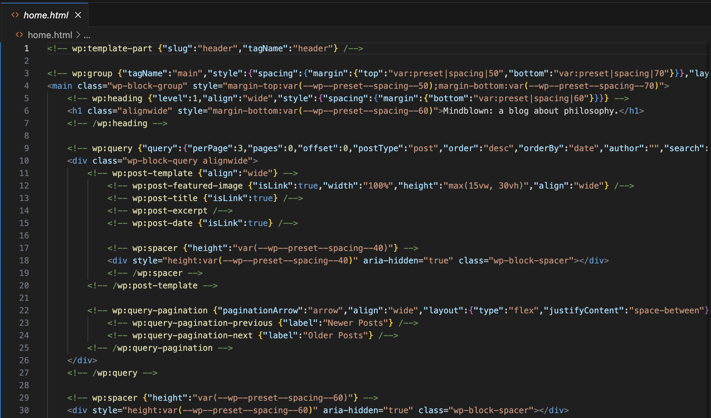
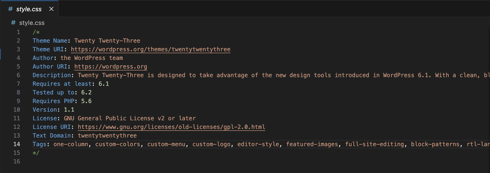
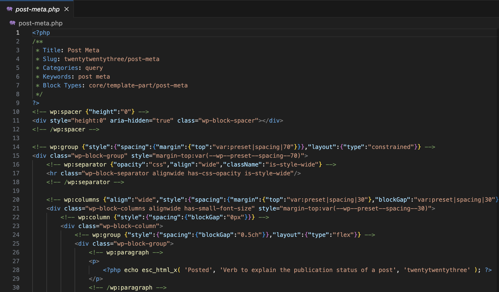
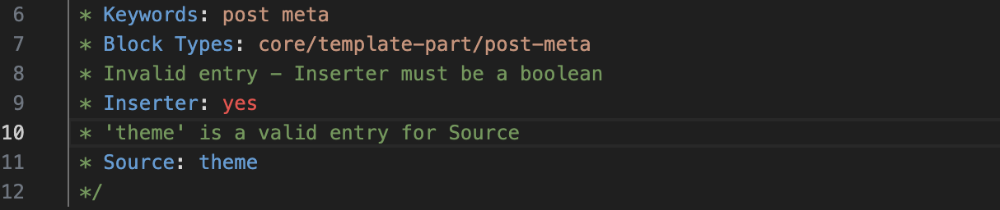
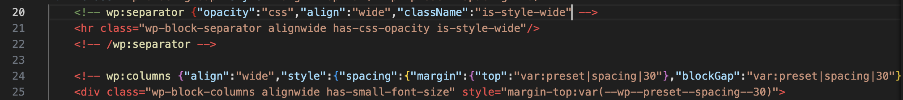

This extension provides syntax highlighting for the following WordPress syntaxes that exist inside traditional comment blocks:

- Plugin header fields (PHP)
- Block patten fields (PHP)
- Theme header fields (style.css)
- Block markup (HTML + JSON)

## Examples

### HTML

### CSS

### PHP

## Additional Features

The Syntax Highlighter also implements rules for pattern/header field validation based on the following official documentation:

- https://developer.wordpress.org/block-editor/reference-guides/block-api/block-patterns/
- https://developer.wordpress.org/themes/advanced-topics/block-patterns/
- https://developer.wordpress.org/plugins/plugin-basics/header-requirements/
- https://developer.wordpress.org/themes/basics/main-stylesheet-style-css/

Unmatched brackets cause error highlighting inside the embedded JSON of WordPress blocks

## Credits

This project was inspired by [Gutenberg Comment Highlight](https://github.com/chrisrhymes/gutenburg-comment-highlight) by [@chrisrhymes](https://github.com/chrisrhymes)

Wapuu design by [@marktimemedia](https://github.com/marktimemedia)
