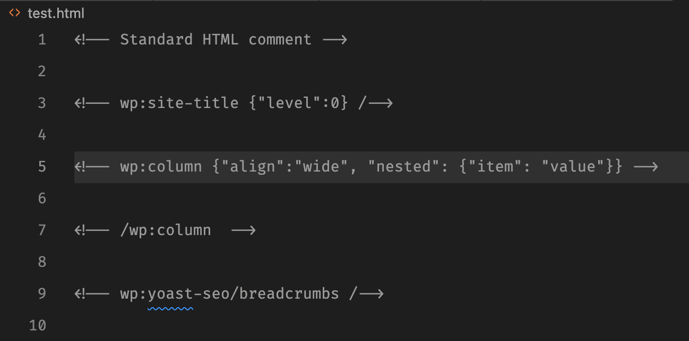

# Gutenberg Comment Highlight

This Visual Studio Code extension adds syntax highlighting to WordPress themes supporting Gutenberg blocks. The extension makes the comments more readable, instead of being greyed out like standard HTML comments.

The block name, beginning with `wp:` will show as a variable and any json strings will have basic json syntax highlighting.

## Before

## After

